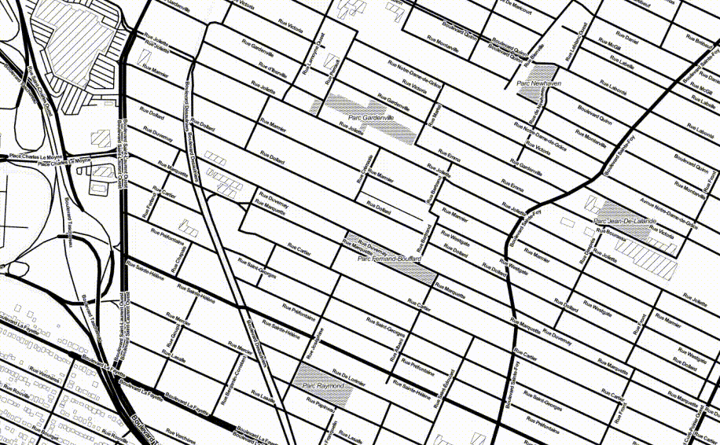

# DeadSimpleTodo

DeadSimpleTodo is a dead-simple terminal todo application. If you are a frequent terminal user, it will give you a frictionless experience like the one it gives me.

# Features

- Parsing of both structured and unstructured date / time phrases (like "07-02", "14:02", "tomorrow", "in 2 hours", "by 3 a.m.";
- Entry sorting: those that have deadlines attached to them will be pushed up in the list; the other ones will be sorted in lexicographical order;
- Frictionless command line navigation;
- Time before deadline;
- Entry filtering;

# Implied workflow (for "lin" users)

- Fork this repo, change the fork's visibility to "private", clone it;
- Add the repo's directory into your `$PATH`;
- Whenever you need it, use `todo.py` and `todoupdate.sh` to synchronize your todo-s;

# Usage recommendations

**Devise your own naming scheme**. For example, prefix your notes with uppercase TAGS to take advantage of the entry sorting and filtering features. Like this: "WORK - claim the usb hub back".

When you edit a note, each line of the document **will be parsed as a separate note**. Use this feature when you need to split a note into two;

# Acknowledgements 

Without these libraries this application would not be dead-simple:

- [simple_term_menu](https://pypi.org/project/simple-term-menu/) is an outstanding library for creating command line-based user interfaces;
- [python-dateutil](https://pypi.org/project/python-dateutil/) is a great library for parsing structured dates;
- Beautiful [tabulate](https://pypi.org/project/tabulate/) library enables you to create neat and tidy tables in command line;
- Last, but not least [parsedatetime](https://pypi.org/project/parsedatetime/) allows one to parse unstructured dates from a text;
