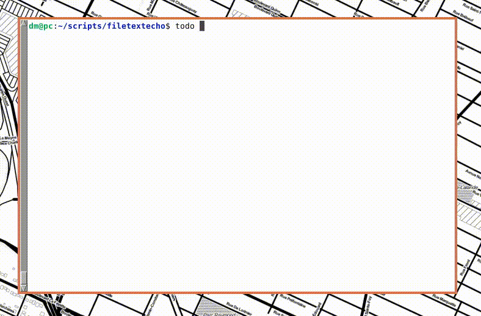

# DeadSimpleTodo

DeadSimpleTodo is a dead-simple terminal todo application. If you are a frequent terminal user, it will give you a frictionless experience like the one it gives me.

# Features

Despite being dead-simple, it has aces in its sleeve.

- Parsing of both structured and unstructured date / time phrases (like "07-02", "14:02", "tomorrow", "in 2 hours", "by 3 a.m.";
- Entry sorting: those that have deadlines attached to them will be pushed up in the list; the other ones will be sorted in lexicographical order;
- Frictionless command line navigation;
- Time before deadline;
- Entry filtering;
- Colored 🟧 output. You can easily tweak the set of regex rules by which a color is selected. Besides colors, you can add any formatter;

# Usage recommendations

## Implied workflow (for "lin" users)

In combination with `git`, it becomes a very powerful notetaking / reminder application with synchronization capabilities.

- Fork this repo, change the fork's visibility to "private", clone it;
- Add the repo's directory into your `$PATH`;
- Whenever you need it, use `todo.py` and `todoupdate.sh` to synchronize your todo-s;

## Other

**Devise your own naming scheme**. For example, prefix your notes with uppercase TAGS to take advantage of the entry sorting and filtering features. Like this: "WORK - claim the usb hub back".

When you edit a note, each line of the document **will be parsed as a separate note**. Use this feature when you need to split a note into two;

# About

It started with a todo script.
I needed a tool which would enable me to make a quick note and push it into a private Github repository in a timely fashion, that means with no more than 3 keystrokes.
The set of requirements which I came up with was very short: git-based synchronization, simple navigation among entries, possibliity to edit them (and fast), date/time-related functionality which would let me see time before deadlines (if there are any), and basic search capabilities.

No project folders, mouse clicks, registration forms, GUI, vaults, or relations between notes.
And if I ever needed something that would resemble the latter, I would create a special naming scheme and get it seamlessly vowen into my workflow.
After all, it is my computer that has to help me with my day-to-day errands, not me helping some relation-oriented data structure to understand intricate links between my notes.

After a series of incremental enhancements, I discovered that my script had become a full-fledged terminal todo application, and it checked every mark I wanted it to check.
Simple and practical, just as it was intended.

# Requirements

Besiders those listed in `requirements.txt`, it uses `vim` for note editing. See `todo.py`.

# Acknowledgements

Without these libraries this application would not be dead-simple:

- [simple_term_menu](https://pypi.org/project/simple-term-menu/) is an outstanding library for creating command line-based user interfaces;
- Great [python-dateutil](https://pypi.org/project/python-dateutil/) is a library for parsing structured dates;
- Beautiful [tabulate](https://pypi.org/project/tabulate/) library enables you to create neat and tidy tables in command line;
- Mindblowing [colorama](https://pypi.org/project/colorama/) to get colored input;
- Last, but not least [parsedatetime](https://pypi.org/project/parsedatetime/) allows one to parse unstructured dates from a text;
